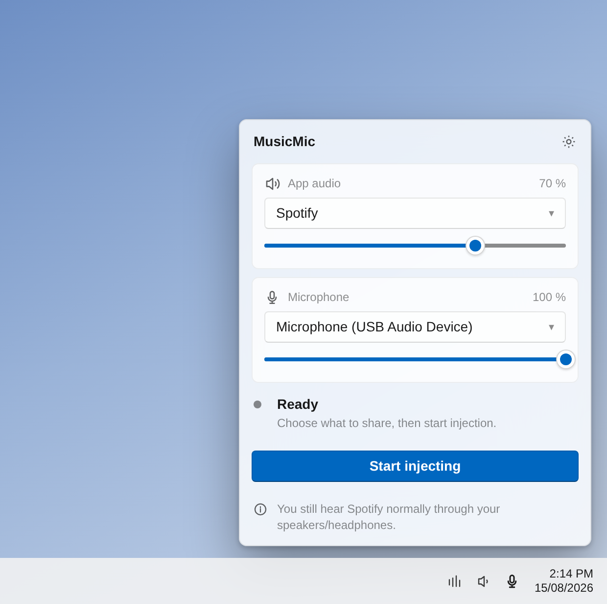
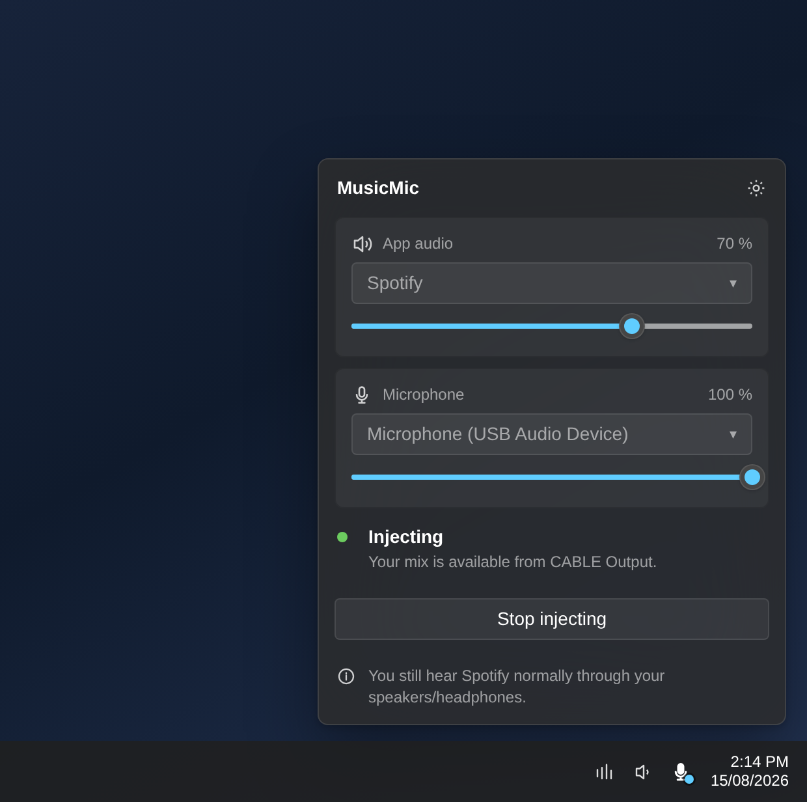
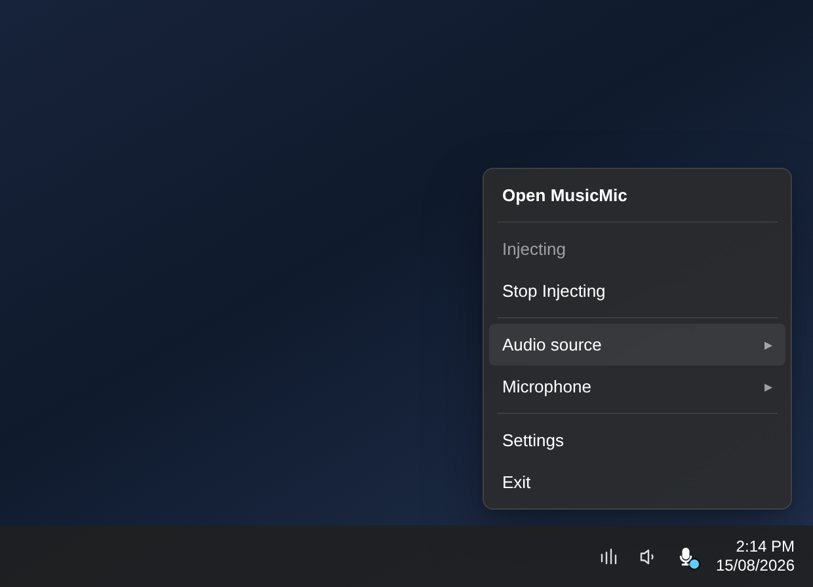
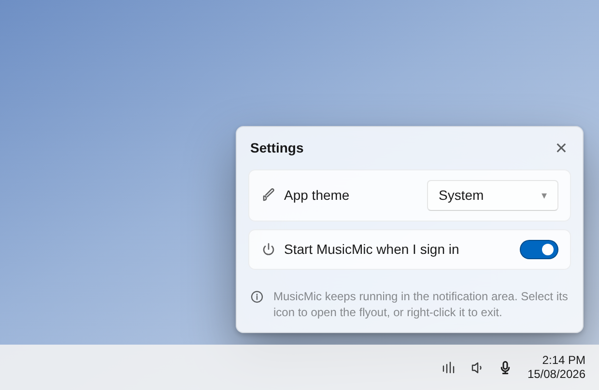

# MusicMic

MusicMic is a compact Windows 11 utility that copies one selected application's rendered audio into a microphone feed while leaving the application's normal playback untouched. It mixes that copy with one physical microphone and writes the result to the VB-CABLE virtual input included by its setup program.

Everyone in your call hears your music and your voice. You keep hearing the app exactly as before.



## Install

**[Download the latest MusicMicSetup.exe](https://github.com/ghively/MusicMic/releases/latest)** — Windows 11 x64.

1. Run **MusicMicSetup.exe** and approve the administrator prompt.
2. The bundled [VB-Audio](https://www.vb-cable.com/) VB-CABLE driver installs first. **Restart Windows if it asks** — `CABLE Input` and `CABLE Output` do not appear until you do.
3. MusicMic starts in the notification area and shows a "MusicMic is running" notification once, so you can find its icon.

Installing over an existing copy replaces it; you will not end up with two entries in Programs and Features. VB-CABLE is donationware and is left installed when you uninstall MusicMic — all participations to VB-Audio are welcome.

MusicMic is not code-signed, so Windows SmartScreen warns the first time you run the setup: choose **More info → Run anyway**. Every release lists the SHA-256 checksums of its downloads so you can confirm you have the file the build produced.

## Use it

MusicMic has no taskbar window. The tray icon is the app.

| | |
| --- | --- |
| **Open** | Select the MusicMic icon in the notification area. The flyout opens beside it. |
| **Close** | Click anywhere else, or press Esc. Nothing stops — closing the flyout is not stopping injection. |
| **Quit** | Right-click the icon → **Exit**. |

**1. Pick what to share.** Choose the application under *App audio* — anything currently playing sound is listed, and Spotify is recognised automatically. Choose your real microphone under *Microphone*; the Windows default is selected for you.

**2. Set the balance.** *App audio* starts at 70% and your microphone at 100%. These are the levels the other side hears — they never touch what you hear.

**3. Select Start injecting.** The status turns green, the selectors lock, and the tray icon gains an accent dot. Your mix is now coming out of `CABLE Input`.

**4. Point your chat app at the cable.** In whatever you are talking on, choose **CABLE Output (VB-Audio Virtual Cable)** as the microphone — in Discord that is **User Settings → Voice & Video → Input Device**. Do this once; it is remembered.



While injecting, MusicMic never touches the selected app's playback: it keeps playing to your speakers or headphones at the same volume, and Windows' default playback device is left alone. Stopping is one click, and the tray icon and menu always tell you which state you are in.



Right-click the icon to switch source or microphone and start or stop without opening the flyout.

### Settings

The gear in the flyout header opens theme and startup settings. Theme follows Windows by default; **Start MusicMic when I sign in** puts it in the notification area at logon, ready but idle.



### If something is missing

- **"VB-CABLE not found"** — the driver did not finish installing. Restart Windows, then reopen MusicMic.
- **The app you want is not listed** — it only appears while it is actually playing audio. Start playback, then reopen the flyout.
- **Your source or microphone disappears mid-call** — MusicMic keeps injecting with the other one and reconnects the missing one on its own; the status line says which is waiting.

The images above are renderings of the shipped design, not captures of a running build; see [the UI reference](docs/ui/tray-flyout.md) for the layout and the platform values it uses.

## Non-negotiable routing rule

Starting or stopping MusicMic must never change an application's playback endpoint, session volume, mute state, playback state, or the Windows default playback endpoint. The native engine captures a parallel, process-specific loopback copy.

## Build and test

Prerequisites:

- Windows 11 x64
- .NET 10 SDK
- Visual Studio 2022 with Desktop development with C++ for the native engine
- Administrator approval and a restart when the bundled VB-CABLE driver is first installed

```powershell
# Builds the native x64 engine, restores the win-x64 runtime when required,
# runs the managed tests, publishes the app, and validates the publish layout.
powershell -ExecutionPolicy Bypass -File scripts\Publish-WinX64.ps1 -Configuration Release -Version 1.1.0

# Runs the publish flow above, builds the MSI, and checks its required metadata.
powershell -ExecutionPolicy Bypass -File scripts\Build-Installer.ps1 -Configuration Release -Version 1.1.0
```

The self-contained application files are written to `artifacts\publish\win-x64\`; the installers are written to `installer\output\MusicMic.msi` and `installer\output\MusicMicSetup.exe`. The release scripts build the native engine first and pass that exact Release x64 DLL to the managed build, so publishing does not rely on a DLL previously left in the source tree.

### Versioning and upgrades

Installing removes the MusicMic already on the machine rather than adding a second entry: the package declares a major upgrade scheduled before the new files are copied, allows upgrades between builds that share a version, and closes a running MusicMic first so no reboot is needed.

**Give each release a version higher than the last** (`-Version 1.2.0`). The bootstrapper's Programs and Features entry is keyed on its own version, and two bundles built at the same version will register separately no matter what the package inside them does. The current version is **1.1.0**.

Pushing a `vX.Y.Z` tag is what publishes a release. `.github/workflows/release.yml` runs the same `Build-Installer.ps1` on a Windows runner, takes the version from the tag, and attaches `MusicMicSetup.exe`, `MusicMic.msi`, and their checksums to the GitHub release. The workflow can also be run manually against a version to build the installers without publishing anything.

## Release validation

`.github/workflows/ci.yml` runs the full package path — native engine, native and managed tests, publish, MSI, bootstrapper, smoke test — on every push and pull request to `main`, so a release tag builds code the same runner has already packaged.

The automated package smoke test checks the self-contained publish layout, the required native DLL, its non-empty PE image, its x64 architecture, and the MSI product metadata. Before release, complete the hardware acceptance matrix as well: source-only, microphone-only, and combined audio; selected-process privacy; source/microphone/sleep recovery; installer/uninstaller/reinstall; and direct verification that Start and Stop preserve the selected app's playback endpoint, volume, mute state, playback state, and Windows defaults. These hardware-dependent checks cannot be simulated by the build scripts.

See `SPEC.md` for authoritative V1 constraints and [the acceptance matrix](docs/acceptance-test-matrix.md) for the required release evidence, including playback-preservation and hardware-only checks.
